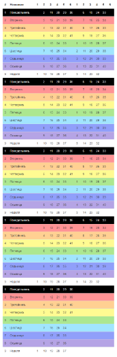
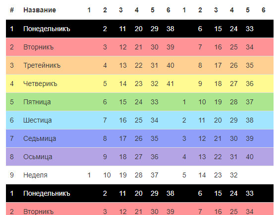

# widget-kolada-dar1

Виджет для рисования календаря Коляда Дар на лето

Версия 1.1.19

Соответствует БОСТ 000006-7528 "О задании формата даты и времени в программном коде для русского календаря" http://avr3.ru/doHmJp 

Выводит месяца в табличный календарь, визуально это выглядит так:
месяца по 41 день справа месяца по 40 дней слева, всего таких строк 5, последняя соответственно с одним месяцем




Пример одного первого блока с заголовком



## Пример использования

```
$v = \avatar\widgets\KaladaDar0::init([
    'dayStart'    => 9,
]);
echo $v->run();
```

`dayStart` - день недели с которого начинается лето от 1 до 9

Расширенный вид запуска с параметрами стилей таблицы:

```
$v = \avatar\widgets\KaladaDar0::init([
    'dayStart'    => 9,
    'isSacral'    => true,
]);
echo $v->run();
```

`optionsWeek` - массив опций для тега `tr` для каждой недели, индексы могут быть от 1 до 9

`optionsColumn` - массив опций для тега `th` для каждой колонки месяца, индексы могут быть от 1 до 6

`weekDays` - массив названий недель, индексы могут быть от 1 до 9

`isSacral` - флаг. Это священный год? Если да то все месяца будут по 41 дню

`emptyCell` - содержимое для отображения пустой ячейки дня 

`isDrawIds` - bool - флаг. Добавлять атрибут id в тег td (формат day_[m]_[d]) для дней

`isDrawDateGrigor` - bool - флаг. Добавлять подсказки к каждому дню в виде григорианской даты? true - добавлять, false - не добавлять. По умолчанию добавлять - false.

`DateGrigorFormat` - string - форматы даты для подсказки если isDrawDateGrigor = true. По умолчанию PHP date() `d.m.Y`

`DateGrigorClass` - string - Название класса для григорианской даты если $isDrawDateGrigor=true

`DateGrigorFirst` - string - Дата первого дня года в григорианском календаре в формате 'Y-m-d', по умолчанию текущий

`monthNames` - array - массив названий месяцев с индексами от 1 до 9

## Как вычислить день недели дня старта лета

В разработке.

## Ссылки

Славяно-Арийский Календарь
http://energodar.net/ha-tha.php?str=vedy%2Fkalendar 

БОСТ №000006-7528 О задании формата даты и времени в программном коде для русского календаря
https://github.com/i-avatar777/kon/blob/master/%D0%91%D0%9E%D0%A1%D0%A2/%D0%91%D0%9E%D0%A1%D0%A2000006-7528.md

Yii2
https://www.yiiframework.com/